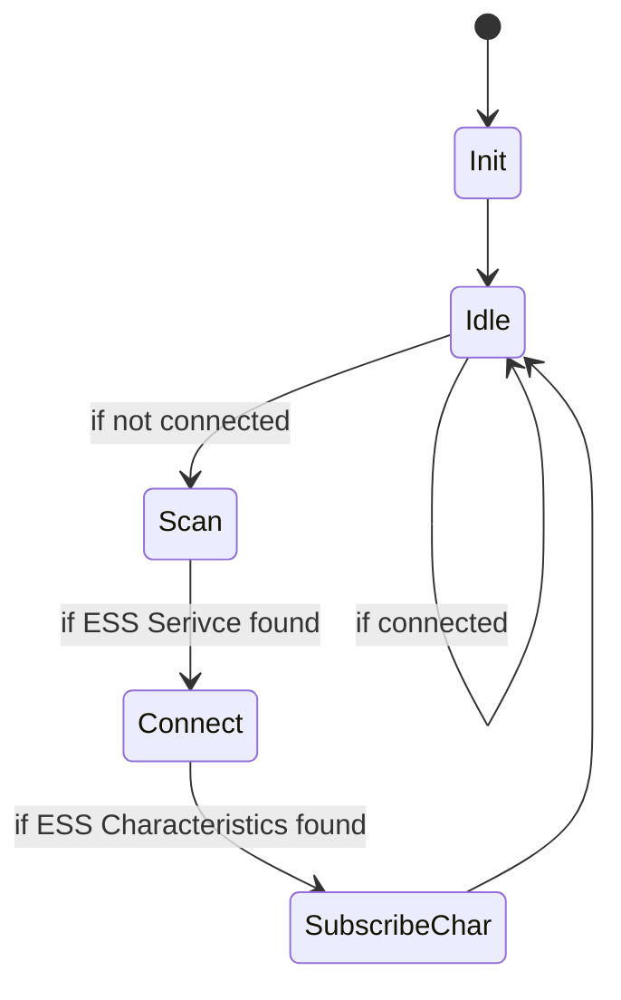

# State Machine


```mermaid

stateDiagram-v2

    [*] --> Init

    Init --> Idle
    Idle --> Scan : if not connected
    Idle --> Idle : if connected
    Scan --> Connect : if ESS Serivce found
    Connect --> SubscribeChar : if ESS Characteristics found
    SubscribeChar --> Idle 


```

# Software Structure

```mermaid

```

